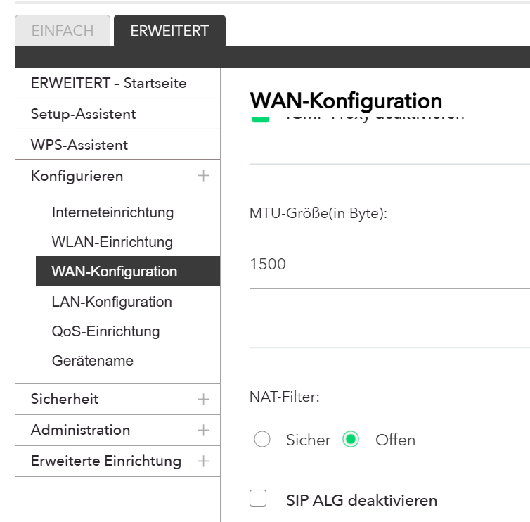
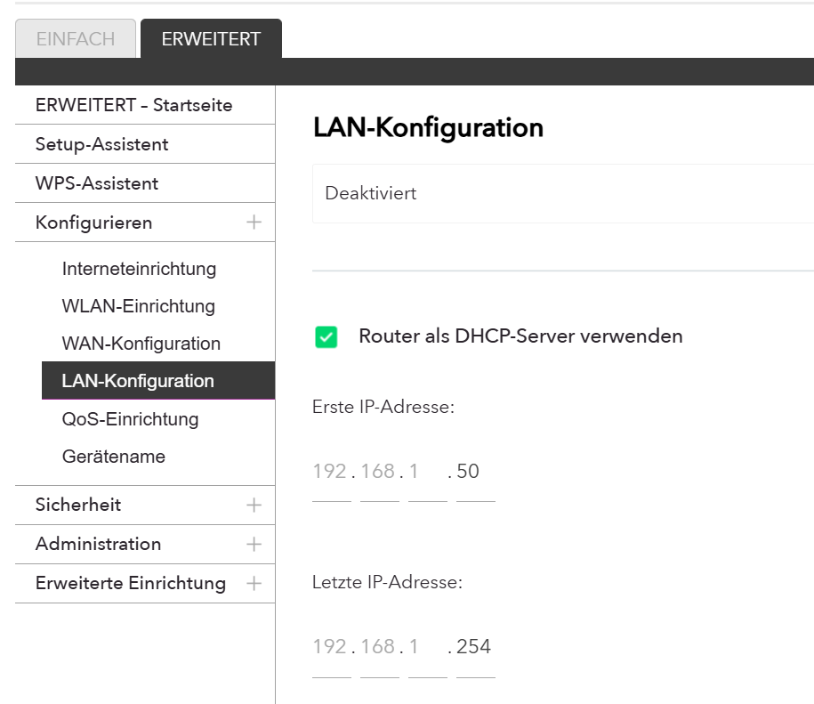
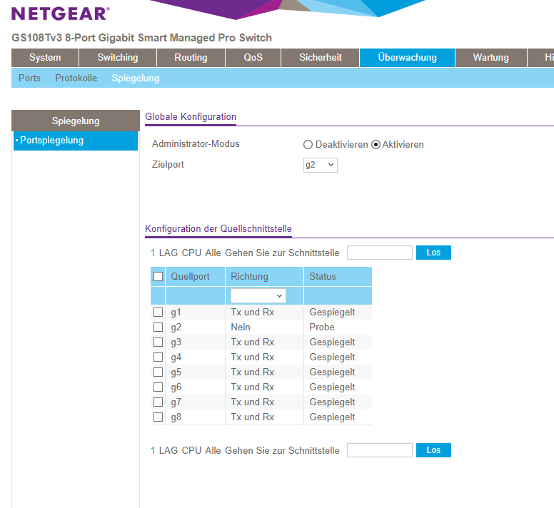

# Raphi-net

Arion, Kaveen, Raphael, Kevin, Leandro

---
## Arbeitspackete

Router, Switch + Dokumentation = Arion + Leandro

Clients = Kevin 
Server + Webserver = Kaveen

---
IP-Adressen Zusammengefasst

| **Bezeichnung**           | **IP-Adresse**    | **Erläuterung**                                                |
|---------------------------|-------------------|----------------------------------------------------------------|
| Router (DHCP)             | 192.168.1.1       | Gerät, das DHCP-Dienste anbietet, DNS: 8.8.8.8, Gateway: 192.168.0.1, range: 192.168.1.50 - 192.168.1.254|
| Server (Webserver), Raphi-Server, Nutzername = raphi        | 192.168.1.2       | Server, der Webdienste bereitstellt                            |
| Win11-Client                  | 192.168.1.52       | Vom DHCP zugewiesene IP-Adresse                                |
| Ubuntu-Client                  | 192.168.1.51       | Vom DHCP zugewiesene IP-Adresse                                |
| Switch                    | 192.168.0.239     | Management-IP der Switch                                       |
| Generelle Netzadresse     | 192.168.1.0       | Netzadresse des Subnetzes                                      |
| Subnetzmaske              | 255.255.255.0     | Ermöglicht 254 Hosts pro Subnetz (2 Adressen reserviert)       |
| Broadcast-Adresse         | 192.168.1.255     | Broadcast-Adresse dieses Subnetzes (für Kommunikation an alle) |
| Lease-Zeitraum            | 2 Stunden         | Zeitspanne, für die DHCP-Adressen vergeben werden              |

# Clients
Die Clients sind standardmässig installiert, sie haben die IP-Adressen aus der Tabelle vom DHCP-Server erhalten und sind nicht statisch eingestellt, d.h. die Adressen können sich ändern. Sie können auch mit den anderen Geräten sauber pingen.

---

# Router
Wir haben den Router wie folgt konfiguriert:

Zuerst haben wir "NAT" auf dem Router aktiviert.

Dann haben wir noch den DHCP-Server aktiviert und so eingestellt, dass die range von 192.168.1.50 bis 192.168.1.254 geht, damit z.B. Server, die mit statischen Adressen hinzugefügt werden, kein Grund sind, die range zu ändern. Dies gilt nur für 47 zusätzliche Server, was ausreichend sein sollte, aber wenn man 48 Server oder Geräte hat, ist man gezwungen, die range zu ändern.

Wie bereits in der IP-Adressentabelle erwähnt, hat der Router die IP-Adresse 192.168.1.1.

# Switch 
Wir mussten nur das "Port Mirroring" auf dem Switch aktivieren, wie im folgenden Bild zu sehen ist. Die Adresse ist 192.168.0.239.

# Server mit Webserver
Diese Aufgabe konnte noch nicht abgeschlossen werden

# Fazit Arion
Die Aufgaben waren spannend, ich konnte mein Wissen unter Beweis stellen und noch mehr lernen. Durch die Aufgaben konnte ich auch etwas von dem Wissen, das ich durch meine Krankheit verpasst habe, lernen und so mein Wissen erweitern. Leider hatten wir Probleme mit dem Server, da er kein Internet wollte, aber mit der Hilfe von Frank konnten wir das lösen.

---

# Fazit Kaveen

---

# Fazit Kevin

---

# Fazit Leandro

---

# Fazit Raphael
Raphael war bei der Durchführung der Aufgaben leider nicht anwesend, so dass er keine Schlussbemerkungen machen kann.

